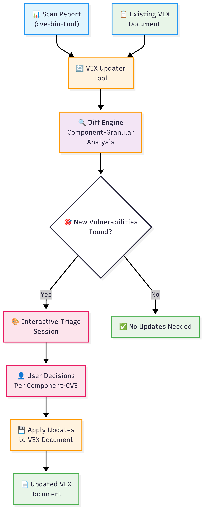
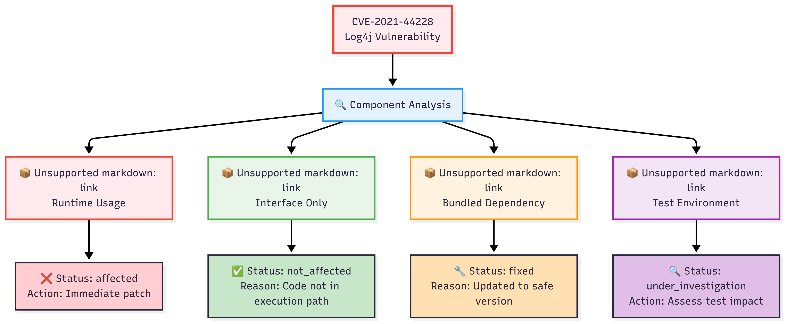

# VEX Updater Tool

A standalone Python command-line tool for **updating VEX (Vulnerability Exploitability eXchange) documents** by comparing security scan reports with existing VEX files. Features component-granular vulnerability triage, multi-format support, and intelligent workflow automation.

## 🔄 Workflow Overview



*The VEX Updater workflow: comparing scan reports with existing VEX documents to identify and triage new vulnerabilities.*

## ✨ Key Features

- **🎯 Component-Granular Triage**: Handle the same CVE differently across multiple components
- **🔄 Intelligent Updates**: Compare scan reports with existing VEX documents to identify changes
- **🎨 Interactive Triage**: User-friendly guided process for vulnerability assessment
- **🔒 Safety First**: Dry-run, diff-only, and backup options prevent accidental data loss
- **🏗️ Multi-Format Support**: CycloneDX, CSAF, and OpenVEX via lib4vex integration
- **⚡ Smart Automation**: Batch processing with customizable default decisions
- **📊 Rich Reporting**: Detailed diff analysis and progress tracking
- **🧪 Battle-Tested**: Comprehensive test suite with high code coverage

## 🚀 Quick Start

1. **Run your security scan:**
   ```bash
   cve-bin-tool . --format json -o scan_results.json
   ```

2. **Update your VEX document:**
   ```bash
   vex-updater --scan-report scan_results.json --vex-file my_project.vex
   ```

3. **Follow the interactive prompts** to triage new vulnerabilities found in the scan.

That's it! Your VEX document now reflects the latest security analysis.

## 📘 Component-Granular Triage Explained

The VEX Updater understands that **the same CVE can affect different components in different ways**:



*Example: CVE-2021-44228 (Log4j vulnerability) affects different components differently, requiring component-specific triage decisions.*

This granular approach ensures accurate vulnerability documentation at the component level, enabling precise risk assessment and remediation planning.

## Installation

### Quick Setup (Recommended)

For the fastest setup, use the provided setup script:

```bash
# Clone the repository
git clone https://github.com/JigyasuRajput/vex-updater.git
cd vex-updater

# Quick setup for users
./scripts/setup.sh

# Or for development setup (includes testing tools)
./scripts/setup.sh dev

# Activate the environment and start using
source .venv/bin/activate
vex-updater --help
```

### Manual Installation Options

#### Option 1: Install from Source (Recommended for Development)

```bash
# Clone the repository
git clone https://github.com/JigyasuRajput/vex-updater.git
cd vex-updater

# Create and activate virtual environment
python -m venv .venv
source .venv/bin/activate  # On Windows: .venv\Scripts\activate

# Install runtime dependencies  
pip install -r requirements.txt

# Install the tool in development mode
pip install -e .
```

### Option 2: Install Runtime Dependencies Only

```bash
# Install only the runtime dependencies
pip install lib4vex>=0.2.0 cyclonedx-python-lib>=3.0.0

# Clone and install
git clone https://github.com/JigyasuRajput/vex-updater.git
cd vex-updater
pip install -e .
```

### Option 3: Development Setup

For contributing or development work:

```bash
# Clone the repository
git clone https://github.com/JigyasuRajput/vex-updater.git
cd vex-updater

# Create and activate virtual environment
python -m venv .venv
source .venv/bin/activate  # On Windows: .venv\Scripts\activate

# Install development dependencies (includes testing tools)
pip install -r requirements-dev.txt

# Install the tool in development mode
pip install -e .

# Verify installation
vex-updater --help
pytest
```

## Usage

### 🎯 Primary Workflow: Update Existing VEX Documents

**Interactive Mode (Recommended):**
```bash
# Update VEX with new scan results
vex-updater --scan-report latest_scan.json --vex-file project_vex.json

# Safe update with backup
vex-updater --scan-report latest_scan.json --vex-file project_vex.json --backup

# Output to new file (preserves original)
vex-updater --scan-report latest_scan.json --vex-file project_vex.json --output-file updated_vex.json
```

**Preview Mode (Explore Changes First):**
```bash
# See what would change without making modifications
vex-updater --scan-report latest_scan.json --vex-file project_vex.json --dry-run

# Show detailed diff analysis
vex-updater --scan-report latest_scan.json --vex-file project_vex.json --diff-only
```

**Batch Processing:**
```bash
# Skip interactive prompts for existing vulnerabilities
vex-updater --scan-report latest_scan.json --vex-file project_vex.json --auto-skip-existing
```

### 🔧 Single Vulnerability Updates

The tool supports single-vulnerability edits:

```bash
# Edit existing VEX document
vex-updater --input-vex existing_vex.json --vuln-id CVE-2021-44228 --status fixed --impact-statement "Patched in version 2.15.0"

# Generate new VEX from scan
vex-updater --cve-bin-json input.json --vuln-id CVE-2021-44228 --status not_affected --justification vulnerable_code_not_present --output vex_output.json
```

### Command Line Options

**Primary Updater Workflow:**
- `--scan-report`: Path to cve-bin-tool JSON output (required)
- `--vex-file`: Path to existing VEX file to update (required)
- `--output-file`: Path for updated VEX file (optional, defaults to new file with .updated.json suffix)

**Safety and Operation Modes:**
- `--dry-run`: Show what would be updated without making changes
- `--diff-only`: Just show the diff without prompting for updates
- `--in-place, -i`: Overwrite the original VEX file (requires explicit flag for safety)
- `--backup`: Create backup of original VEX file before modification
- `--interactive`: Use interactive triage session (default)
- `--auto-skip-existing`: Don't prompt for vulnerabilities already in VEX

**Single Vulnerability Mode Options:**
- `--cve-bin-json`: Path to JSON output from cve-bin-tool
- `--input-vex`: Path to existing VEX document to edit
- `--vuln-id`: The CVE identifier (e.g., CVE-2021-44228)
- `--status`: VEX status (not_affected, affected, fixed, under_investigation)
- `--justification`: Justification for the status (required for not_affected)
- `--impact-statement`: Detailed description of the impact

**Utility Options:**
- `--debug`: Set debug level for detailed logging output (debug, info, warning, error, critical - default: warning)
- `--explain`: Show detailed explanations (status, justification, format, workflow, best-practices)
- `--validate-only`: Validate inputs without making changes
- `--format`: Output format for new VEX documents (cyclonedx, csaf, openvex - default: cyclonedx)

### Supported VEX Statuses

- `not_affected`: Component is not affected by the vulnerability
- `affected`: Component is affected by the vulnerability  
- `fixed`: Vulnerability has been fixed in the component
- `under_investigation`: The impact is being investigated

### Justification Values (for not_affected status)

- `vulnerable_code_not_present`: The vulnerable code is not present
- `vulnerable_code_not_in_execute_path`: The vulnerable code is present but not in the execution path
- `vulnerable_code_cannot_be_controlled_by_adversary`: The vulnerable code cannot be controlled by an adversary
- `inline_mitigations_already_exist`: Inline mitigations already exist

## Examples

### 🎯 Primary Workflow Examples

**Example 1: First-Time VEX Update (Interactive)**
```bash
# Update project VEX with latest scan results
vex-updater --scan-report security_scan_2024.json --vex-file project_security.vex

# The tool will guide you through triaging new vulnerabilities:
# 🔍 CVE-2024-1234 for component-a v1.2.3
# 📦 Component: component-a v1.2.3  
# Action: [t]riage, [s]kip, [q]uit: t
# Status: 1. not_affected, 2. affected, 3. fixed, 4. under_investigation
# Select status (1-4): 1
# Justification: 1. vulnerable_code_not_present...
```

**Example 2: Safe Production Update**
```bash
# Create backup and output to new file
vex-updater --scan-report weekly_scan.json \
  --vex-file production.vex \
  --output-file production_updated.vex \
  --backup
```

**Example 3: Preview Changes Before Applying**
```bash
# See what would change without modifications
vex-updater --scan-report latest_scan.json --vex-file current.vex --dry-run

# 📋 DRY RUN RESULTS:
# =================================
# 🆕 New vulnerabilities to add: 3
# 🗑️  Vulnerabilities no longer in scan: 1
# ✅ Vulnerabilities up to date: 12
```

**Example 4: Multi-Component Scenario**
```bash
# Handle same CVE affecting multiple components differently
vex-updater --scan-report microservices_scan.json --vex-file services.vex

# CVE-2021-44228 in log4j-core@2.14.1     → Set as "affected" 
# CVE-2021-44228 in log4j-api@2.14.1      → Set as "not_affected"
# CVE-2021-44228 in elasticsearch@7.15.0  → Set as "fixed"
```

**Example 5: Debug Mode**
```bash
# Run with detailed debug logging
vex-updater --scan-report scan.json --vex-file project.vex --debug debug

# Run with info level logging
vex-updater --scan-report scan.json --vex-file project.vex --debug info

# Run with error level logging only
vex-updater --scan-report scan.json --vex-file project.vex --debug error
```

### 🔧 Single Vulnerability Mode Examples

**Example 5: Single Vulnerability Update**
```bash
# Update specific vulnerability in existing VEX
vex-updater --input-vex existing_vex.json \
  --vuln-id CVE-2021-44228 \
  --status fixed \
  --impact-statement "Patched in version 2.15.0"
```

**Example 6: Generate New VEX Entry**
```bash
# Add single vulnerability to new VEX document
vex-updater --cve-bin-json scan_results.json \
  --vuln-id CVE-2021-44228 \
  --status not_affected \
  --justification vulnerable_code_not_present \
  --output single_vuln.json
```

## Input Format

The tool supports multiple JSON input formats produced by cve-bin-tool:

### Standard JSON Format
```json
{
  "components": [
    {
      "name": "log4j-core",
      "version": "2.14.1", 
      "purl": "pkg:maven/org.apache.logging.log4j/log4j-core@2.14.1",
      "vulnerabilities": [
        {
          "vuln_id": "CVE-2021-44228",
          "description": "Remote code execution in log4j."
        }
      ]
    }
  ]
}
```

### JSON2 Format (Newer cve-bin-tool versions)
```json
{
  "metadata": {
    "timestamp": "2024-01-01T00:00:00Z"
  },
  "results": [
    {
      "cve_id": "CVE-2021-44228",
      "package": {
        "name": "log4j-core",
        "version": "2.14.1",
        "purl": "pkg:maven/org.apache.logging.log4j/log4j-core@2.14.1"
      },
      "description": "Remote code execution in log4j.",
      "severity": "HIGH",
      "cvss_score": 9.8
    }
  ]
}
```

The tool automatically detects and handles both formats, so you can use either `cve-bin-tool . --format json` or `cve-bin-tool . --format json2`.

## Output Formats

The tool supports multiple VEX document formats:

### CycloneDX Format

The tool can generate/edit CycloneDX 1.4 compliant VEX documents:

```json
{
  "bomFormat": "CycloneDX",
  "specVersion": "1.4",
  "serialNumber": "urn:uuid:...",
  "version": 1,
  "components": [
    {
      "name": "log4j-core",
      "version": "2.14.1",
      "type": "library",
      "purl": "pkg:maven/org.apache.logging.log4j/log4j-core@2.14.1"
    }
  ],
  "vulnerabilities": [
    {
      "id": "CVE-2021-44228",
      "source": {
        "name": "NVD",
        "url": "https://nvd.nist.gov/vuln/detail/CVE-2021-44228"
      },
      "analysis": {
        "state": "not_affected",
        "justification": "code_not_present",
        "detail": "The vulnerable function is never called in our product."
      }
    }
  ]
}
```

### CSAF Format Support

Support for CSAF (Common Security Advisory Framework) VEX documents is planned for future releases.

### OpenVEX Format Support  

Support for OpenVEX format documents is planned for future releases.

## Testing

Run the comprehensive test suite:

```bash
pytest
```

Run tests with coverage report:

```bash
pytest --cov=vex_generate_tool --cov-report=term-missing --cov-report=html
```

The test suite includes:
- **CLI Argument Parsing**: All argument combinations and validation
- **VEX Generation Logic**: All statuses and justifications
- **File I/O**: Input validation and output generation
- **Error Handling**: Invalid inputs, missing files, edge cases
- **Integration Tests**: End-to-end functionality testing

## 🏗️ Architecture Overview

The VEX Updater follows a modular architecture with clear separation of concerns:

```
vex-updater-tool/
├── vex_updater_tool/              # Main package
│   ├── main.py                    # 🚪 CLI entry point and orchestration
│   ├── updater.py                 # 🎯 Main orchestrator (coordinates all operations)
│   ├── scan_parser.py             # 📊 Parse cve-bin-tool outputs  
│   ├── vex_parser.py              # 📋 Multi-format VEX document handling
│   ├── diff_engine.py             # 🔍 Component-granular diff analysis
│   ├── interactive_triage.py      # 🎨 User interaction and triage sessions
│   ├── user_guidance.py           # 📚 Help and best practices
│   └── error_handling.py          # 🛡️ Robust error management
├── tests/                         # 🧪 Comprehensive test suite
│   ├── test_updater.py           # Core updater functionality
│   ├── test_diff_engine.py       # Diff analysis logic
│   ├── test_generator.py         # Generator functionality tests
│   └── test_main.py              # CLI interface tests
├── pyproject.toml                # 📦 Project metadata and dependencies
├── README.md                     # 📖 This comprehensive guide
└── examples.sh                   # 🎬 Live demonstration script
```

## 🔄 Workflow Comparison

### Benefits of Batch Processing

The VEX Updater provides efficient batch processing capabilities:

- ✅ **Batch Processing**: Handle multiple vulnerabilities at once
- ✅ **Component Granularity**: Same CVE, different components, different decisions
- ✅ **Change Detection**: Only update what's actually changed
- ✅ **Safety Features**: Dry-run, backups, and validation
- ✅ **Better UX**: Interactive guidance and rich feedback

### Workflow Comparison

**Single Vulnerability Processing:**
```bash
# Process each vulnerability individually
vex-updater --cve-bin-json scan.json --vuln-id CVE-2021-44228 --status fixed
vex-updater --cve-bin-json scan.json --vuln-id CVE-2022-1234 --status not_affected
# ... repeat for each CVE
```

**Batch Processing (Recommended):**
```bash
# Process all vulnerabilities in one interactive session
vex-updater --scan-report scan.json --vex-file project.vex
# Interactive session handles all new CVEs automatically
```

### Command Compatibility

**All commands work seamlessly!** The updater supports both approaches:

```bash
# ✅ Single vulnerability mode
vex-updater --input-vex existing.json --vuln-id CVE-2021-44228 --status fixed

# ✅ Batch processing mode
vex-updater --scan-report scan.json --vex-file project.vex
```

## Error Handling

The tool provides clear error messages for common issues:

- Missing required justification for `not_affected` status
- Vulnerability ID not found in input data
- Invalid input file format or missing files
- Invalid status or justification values

## Development

To contribute to the project:

1. **Fork the repository** on GitHub
2. **Clone your fork** locally
3. **Set up development environment**:
   ```bash
   python -m venv .venv
   source .venv/bin/activate  # On Windows: .venv\Scripts\activate
   pip install -r requirements-dev.txt
   pip install -e .
   ```
4. **Make your changes** and add tests
5. **Run tests**: `pytest --cov=vex_generate_tool --cov-report=term-missing`
6. **Check code quality**:
   ```bash
   black vex_generate_tool/ tests/
   isort vex_generate_tool/ tests/
   flake8 vex_generate_tool/ tests/
   ```
7. **Submit a pull request**

See [CONTRIBUTING.md](CONTRIBUTING.md) for detailed contribution guidelines.

## License

This is a personal project with no specific license.

## Contributing

We welcome contributions! Please see [CONTRIBUTING.md](CONTRIBUTING.md) for guidelines on:
- Setting up the development environment
- Running tests and code quality checks
- Submitting pull requests
- Reporting issues and feature requests

## 📚 Advanced Usage Guides

### Getting Started with VEX Updating

**First-Time Setup:**
1. Install the tool following the [Quick Setup](#quick-setup-recommended) guide
2. Run your first security scan: `cve-bin-tool . --format json -o initial_scan.json`
3. Create a minimal VEX file or use an existing one
4. Run the updater: `vex-updater --scan-report initial_scan.json --vex-file my_project.vex`

### Understanding Component-Granular Triage

**Why Component Granularity Matters:**
```bash
# Example: log4j vulnerability affects different components differently
CVE-2021-44228:
├── MyApp v1.0 uses log4j-core directly     → Status: affected (needs immediate patching)
├── ThirdPartyLib v2.1 bundles log4j-api   → Status: not_affected (only interface, no execution)
└── TestFramework v3.0 uses log4j v2.15.0  → Status: fixed (upgraded to safe version)
```

**Triage Best Practices:**
- **not_affected + vulnerable_code_not_present**: Component doesn't include the vulnerable code
- **not_affected + vulnerable_code_not_in_execute_path**: Code present but not executed
- **affected**: Component is vulnerable and needs attention
- **fixed**: Vulnerability has been patched or mitigated
- **under_investigation**: Impact assessment in progress

### Multi-format VEX Support

**CycloneDX (Recommended):**
```bash
# Most common format, excellent tooling support
vex-updater --scan-report scan.json --vex-file project.cyclonedx.json --format cyclonedx
```

**CSAF (Enterprise):**
```bash
# Common in enterprise environments, security advisory format
vex-updater --scan-report scan.json --vex-file project.csaf.json --format csaf
```

**OpenVEX (Emerging):**
```bash
# Lightweight format for cloud-native environments
vex-updater --scan-report scan.json --vex-file project.openvex.json --format openvex
```

### Integration with CI/CD Pipelines

**GitHub Actions Example:**
```yaml
name: Update VEX Document
on:
  schedule:
    - cron: '0 2 * * *'  # Daily at 2 AM
  workflow_dispatch:

jobs:
  update-vex:
    runs-on: ubuntu-latest
    steps:
      - uses: actions/checkout@v4
      - name: Run Security Scan
        run: cve-bin-tool . --format json -o scan_results.json
      
      - name: Update VEX Document
        run: |
          vex-updater --scan-report scan_results.json \
            --vex-file security/project.vex \
            --auto-skip-existing \
            --backup
      
      - name: Commit Updates
        run: |
          git add security/
          git commit -m "docs: update VEX document with latest scan results"
          git push
```

**Jenkins Pipeline Example:**
```groovy
pipeline {
    agent any
    triggers {
        cron('H 2 * * *')
    }
    stages {
        stage('Security Scan') {
            steps {
                sh 'cve-bin-tool . --format json -o scan_results.json'
            }
        }
        stage('Update VEX') {
            steps {
                sh '''
                    vex-updater --scan-report scan_results.json \
                      --vex-file project_security.vex \
                      --dry-run
                '''
            }
        }
    }
}
```

### Batch Vulnerability Triage Best Practices

**1. Regular Scanning Schedule:**
- Daily: Critical production systems
- Weekly: Development environments  
- Monthly: Internal tools and dependencies

**2. Triage Workflow:**
```bash
# Step 1: Preview changes
vex-updater --scan-report latest.json --vex-file current.vex --diff-only

# Step 2: Backup and update
vex-updater --scan-report latest.json --vex-file current.vex --backup --interactive

# Step 3: Validate results
vex-updater --vex-file current.vex --validate-only
```

**3. Team Collaboration:**
- Use `--dry-run` to share proposed changes with security team
- Document impact statements thoroughly for audit trails
- Regular review of `under_investigation` status items

## 🔧 Troubleshooting

### Common Issues and Solutions

**Issue: "Format not detected"**
```bash
# Solution: Explicitly specify format
vex-updater --scan-report scan.json --vex-file doc.json --format cyclonedx
```

**Issue: "No vulnerabilities found in scan"**
```bash
# Solution: Verify scan file format
cat scan_results.json | jq '.vulnerabilities | length'
```

**Issue: "Permission denied on VEX file"**
```bash
# Solution: Use output to new file
vex-updater --scan-report scan.json --vex-file readonly.vex --output-file updated.vex
```

**Issue: "Large scan report performance"**
```bash
# Solution: Use --diff-only first
vex-updater --scan-report large_scan.json --vex-file project.vex --diff-only
```

### Getting Help

**Built-in Guidance:**
```bash
# Get explanation of VEX concepts
vex-updater --explain status
vex-updater --explain justification
vex-updater --explain workflow
vex-updater --explain best-practices
```

**Verbose Debugging:**
```bash
# Enable detailed logging
vex-updater --scan-report scan.json --vex-file project.vex --debug debug

# Enable info level logging
vex-updater --scan-report scan.json --vex-file project.vex --debug info

# Enable error level logging only
vex-updater --scan-report scan.json --vex-file project.vex --debug error
```

## Repository

- **GitHub**: https://github.com/JigyasuRajput/vex-updater-tool
- **Issues**: https://github.com/JigyasuRajput/vex-updater-tool/issues
- **Pull Requests**: https://github.com/JigyasuRajput/vex-updater-tool/pulls
